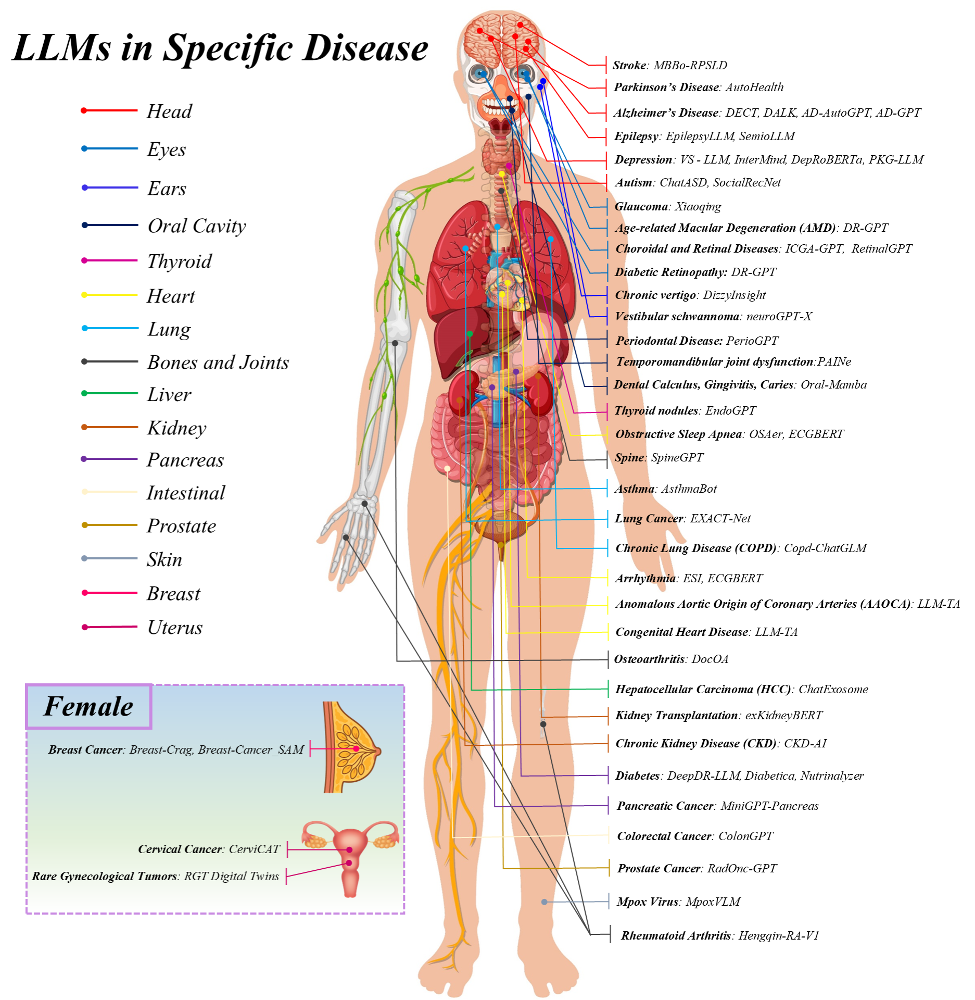
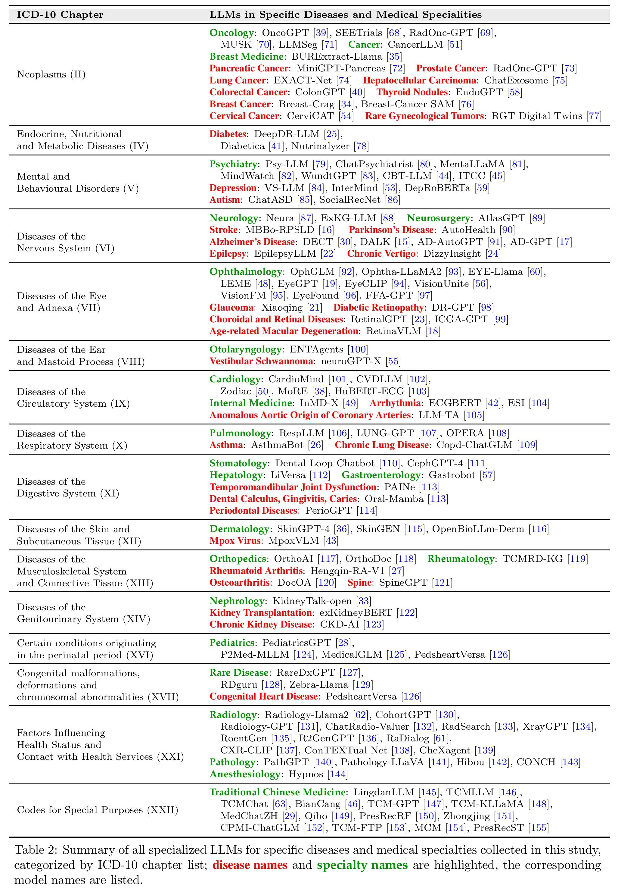

# Awesome-Specialized-Medical-LLMs🧑‍⚕️

This repository provides a curated collection of research on Specialized Medical Large Language Models (SMed-LLMs) for specific diseases and medical specialties, organized by [ICD-10](https://icd.who.int/browse10/2019/en) chapters.

## 📋Table of contents

- [Certain Infectious and Parasitic Diseases](#Certain Infectious and Parasitic Diseases (I))
  - Specific Diseases: [Tuberculosis](#Tuberculosis), [HIV](#HIV)
- [Neoplasms (II)](#neoplasms-ii)
  - Medical Specialities: [Oncology](#Oncology), [Cancer](#Cancer), [Breast Medicine](#Breast-Medicine)

  - Specific Diseases: [Pancreatic Cancer](#Pancreatic-Cancer), [Prostate Cancer](#Prostate-Cancer), [Hepatocellular Carcinoma](#Hepatocellula-Carcinoma), [Lung Cancer](#Lung-Cancer), [Thyroid Nodules](#Thyroid-Nodules), [Colorectal Cancer](#Colorectal-Cancer), [Breast Cancer](#Breast-Cancer), [Cervical Cancer](#Cervical-Cancer)

- [Endocrine, Nutritional and Metabolic Diseases (IV)](#endocrine-nutritional-and-metabolic-diseases-iv)
  - Specific Diseases: [Diabetes](#Diabetes)

- [Mental and Behavioural Disorders (V)](#mental-and-behavioural-disorders-v)
  - Medical Specialities: [Psychiatry](#Psychiatry)
  - Specific Diseases: [Depression](#Depression), [Autism](#Autism)

- [Diseases of the Nervous System (VI)](#diseases-of-the-nervous-system-vi)
  - Medical Specialities: [Neurology](#Neurology), [Neurosurgery](#Neurosurgery)
  - Specific Diseases: [Stroke](#Stroke), [Parkinson’s Disease](#Parkinson’s-Disease), [Alzheimer’s Disease](#Alzheimer’s-Disease), [Vestibular Schwannoma](#Vestibular-Schwannoma), [Epilepsy](#Epilepsy), [Chronic Vertigo](#Chronic-Vertigo)

- [Diseases of the Eye and Adnexa (VII)](#diseases-of-the-eye-and-adnexa-vii)
  - Medical Specialities: [Ophthalmology](#Ophthalmology)
  - Specific Diseases: [Glaucoma](#Glaucoma), [Diabetic Retinopathy](#Diabetic-Retinopathy), [Choroidal and Retinal Diseases](#Choroidal-and-Retinal-Diseases), [Age-related Macular Degeneration](#Age-related-Macular-Degeneration)

- [Diseases of the Ear and Mastoid Process (VIII)](#diseases-of-the-ear-and-mastoid-process-viii)
  - Medical Specialities: [Otolaryngology](#Otolaryngology)
  - Specific Diseases: [Vestibular Schwannoma](#Vestibular-Schwannoma)

- [Diseases of the Circulatory System (IX)](#diseases-of-the-circulatory-system-ix)
  - Medical Specialities: [Cardiology](#Cardiology), [Internal Medicine](#Internal-Medicine)
  - Specific Diseases: [Arrhythmia](#Arrhythmia), [Anomalous Aortic Origin of Coronary Arteries](#Anomalous-Aortic-Origin-of-Coronary-Arteries)

- [Diseases of the Respiratory System (X)](#diseases-of-the-respiratory-system-x)
  - Medical Specialities: [Pulmonology](#Pulmonology)
  - Specific Diseases: [Asthma](#Asthma), [Chronic Lung Disease (COPD)](#Chronic-Lung-Disease-(COPD)), [Pneumonia](#Pneumonia), [COVID-19](#COVID-19)

- [Diseases of the Digestive System (XI)](#diseases-of-the-digestive-system-xi)
  - Medical Specialities: [Stomatology](#Stomatology), [Hepatology](#Hepatology), [Gastroenterology](#Gastroenterology)
  - Specific Diseases: [Periodontal Diseases](#Periodontal-Diseases)

- [Diseases of the Skin and Subcutaneous Tissue (XII)](#diseases-of-the-skin-and-subcutaneous-tissue-xii)
  - Medical Specialities: [Dermatology](#Dermatology)
  - Specific Diseases: [Mpox Virus](#Mpox-Virus)

- [Diseases of the Musculoskeletal System and Connective Tissue (XIII)](#diseases-of-the-musculoskeletal-system-and-connective-tissue-xiii)
  - Medical Specialities: [Orthopedics](#Orthopedics), [Rheumatology](#Rheumatology)
  - Specific Diseases: [Rheumatoid Arthritis](#Rheumatoid-Arthritis), [Osteoarthritis](#Osteoarthritis), [Rib Fracture](#RibFracture), [Spine](#Spine), [Spondyloarthritis](#Spondyloarthritis), [Chronic low back pain (CLBP)](#CLBP)  

- [Diseases of the Genitourinary System (XIV)](#diseases-of-the-genitourinary-system-xiv)
  - Medical Specialities: [Nephrology](#Nephrology)
  - Specific Diseases: [Kidney Transplantation](#Kidney-Transplantation), [Chronic Kidney Disease](#Chronic-Kidney-Disease), [Acute Kidney Injury](#Acute-Kidney-Injury), [Kidney Stone](#Kidney-Stone)

- [Pregnancy, Childbirth and the Puerperium (XV)](#Pregnancy, Childbirth and the Puerperium (XV))
  
  - Specific Diseases: [Gestational Diabetes](#Gestational-Diabetes)
  
- [Certain Conditions Originating in the Perinatal Period (XVI)](#certain-conditions-originating-in-the-perinatal-period-xvi)
  - Medical Specialities: [Pediatrics](#Pediatrics), [Pediatric Cardiology](#Pediatric-Cardiology)
  - Specific Diseases: [Perioperative Sepsis](#Perioperative-Sepsis)

- [Congenital Malformations, Deformations, and Chromosomal Abnormalities (XVII)](#congenital-malformations-deformations-and-chromosomal-abnormalities-xvii)
  - Medical Specialities: [Rare Disease](#Rare-Disease)
  - Specific Diseases: [Congenital Heart Disease](#Congenital-Heart-Disease)

- [Factors Influencing Health Status and Contact with Health Services (XXI)](#factors-influencing-health-status-and-contact-with-health-services-xxi)
  - Medical Specialities: [Radiology](#Radiology), [Pathology](#Pathology), [Anesthesiology](#Anesthesiology)

- [Codes for Special Purposes (XXII)](#codes-for-special-purposes-xxii)
  - Medical Specialities: [Traditional Chinese Medicine](#Traditional-Chinese-Medicine)

------

## 📽️Visualization

- **Annotated human body diagram** illustrating LLMs in 45 specific diseases across 17 organ systems, including female-specific conditions. Organ systems are color-coded; ***disease names*** are in bold italics, followed by the corresponding *model names*.

  

- Summary of all specialized medical LLMs for specific diseases and distinct medical specialties collected in this study, categorized by ICD-10 chapter list; disease names and specialty names are highlighted, the corresponding model names are listed.

  

------

## <a name="Certain Infectious and Parasitic Diseases (I)">Certain Infectious and Parasitic Diseases (I)</a>
**Specific Diseases**

|                  Diseases                   |                            Paper                             |       Submitted in       |                         Description                          | Repo/Demo |
| :-----------------------------------------: | :----------------------------------------------------------: | :----------------------: | :----------------------------------------------------------: | :-------: |
| Tuberculosis | [Transforming Tuberculosis Care: Optimizing Large Language Models for Enhanced Clinician-Patient Communication](https://arxiv.org/abs/2502.21236) | GenAI4Health @ AAAI 2025 | Optimized a conversational AI for Spanish-speaking TB patients, focusing on cultural relevance, empathy, medical accuracy, and privacy. |     -     |
|                                             | [Advancing Chronic Tuberculosis Diagnostics Using Vision-Language Models: A Multi modal Framework for Precision Analysis](https://arxiv.org/abs/2503.14536) |      arXiv 2025/03       | Vision-language model using SIGLIP and Gemma-3b integrates chest X-rays and clinical data for accurate, automated chronic TB detection and reporting. |     -     |
|          HIV          | [Enhanced Language Models for Predicting and Understanding HIV Care Disengagement: A Case Study in Tanzania](https://pmc.ncbi.nlm.nih.gov/articles/PMC12083686/) | Research Square 2025/05  | Fine-tuned LLaMA 3.1 on Tanzanian EMR data for accurate, interpretable prediction of HIV care disengagement. |     -     |

------

## Neoplasms (II)

**Medical Specialities**

| Speciality      |                            Paper                             | Submitted in                                      | Description                                                  |                    Repo/Demo                    |
| --------------- | :----------------------------------------------------------: | ------------------------------------------------- | ------------------------------------------------------------ | :---------------------------------------------: |
| Oncology        | [Radonc-gpt: A large language model for radiation oncology](https://arxiv.org/abs/2309.10160) | arXiv 2023/09                                     | Instruction-tuned LLM for radiotherapy plan generation and decision support. |                        -                        |
|                 | [Oncogpt: A medical conversational model tailored with oncology domain expertise on a large language model meta-ai (llama)](https://arxiv.org/abs/2402.16810) | arXiv 2024/02                                     | Multi-stage fine-tuned LLM for oncology Q&A and treatment recommendations. | [OncoGPT](https://github.com/OncoGPT1/OncoGPT1) |
|                 | [SEETrials: Leveraging large language models for safety and efficacy extraction in oncology clinical trials](https://www.sciencedirect.com/science/article/pii/S2352914824001461#sec3) | Informatics in Medicine Unlocked 2024             | GPT-4 plus prompts for automated extraction of clinical trial outcomes in oncology. |                        -                        |
|                 | [LLM-driven multimodal target volume contouring in radiation oncology](https://www.nature.com/articles/s41467-024-53387-y) | Nature Communications 2024                        | Multimodal LLM framework for 3D target volume segmentation in radiotherapy. |  [LLMSeg](https://github.com/tvseg/MM-LLM-RO)   |
|                 | [A vision-language foundation model for precision oncology](https://www.nature.com/articles/s41586-024-08378-w) | Nature 2025                                       | Unified vision-language model for multimodal cancer detection and biomarker prediction. | [MUSK](https://github.com/lilab-stanford/MUSK)  |
| Cancer          | [Cancerllm: A large language model in cancer domain](https://arxiv.org/abs/2406.10459) | arXiv 2024/06                                     | Mistral-style LLM pre-trained and fine-tuned for cancer phenotype extraction and diagnosis. |                        -                        |
| Breast Medicine | [Burextract-llama: An llm for clinical concept extraction in breast ultrasound reports](https://dl.acm.org/doi/abs/10.1145/3688868.3689200) | Multimedia Computing for Health and Medicine 2024 | Q-LoRA fine-tuned Llama3 model for structured information extraction from breast ultrasound. |                        -                        |

**Specific Diseases**

|                           Diseases                           |                            Paper                             |                Submitted in                |                         Description                          |                          Repo/Demo                           |
| :----------------------------------------------------------: | :----------------------------------------------------------: | :----------------------------------------: | :----------------------------------------------------------: | :----------------------------------------------------------: |
|    Pancreatic Cancer     | [MiniGPT-Pancreas: Multimodal Large Language Model for Pancreas Cancer Classification and Detection](https://arxiv.org/abs/2412.15925) |               arXiv 2024/12                | Multimodal LLM integrating CT and prompts for pancreatic cancer classification and detection. | [MiniGPT-Pancreas](https://github.com/elianastasio/MiniGPT-Pancreas) |
|      Prostate Cancer       | [RadOnc-GPT (gpt-4o) versus human data extraction for prostate cancer clinical research](https://ascopubs.org/doi/abs/10.1200/JCO.2025.43.5_suppl.425) | American Society of Clinical Oncology 2025 | Instruction-tuned Llama2 automates radiotherapy regimens and clinical report generation. |                              -                               |
| Hepatocellular Carcinoma | [ChatExosome: An Artificial Intelligence (AI) Agent Based on Deep Learning of Exosomes Spectroscopy for Hepatocellular Carcinoma (HCC) Diagnosis](https://pubs.acs.org/doi/10.1021/acs.analchem.4c06677) |         Analytical Chemistry 2025          | Fuses exosome Raman spectra transformer with RAG-LLM for HCC diagnosis and Q&A. |    [ChatExosome](https://github.com/yangzj21/ChatExosome)    |
|          Lung Cancer           | [EXACT-Net: EHR-guided lung tumor auto-segmentation for non-small cell lung cancer radiotherapy](https://arxiv.org/abs/2402.14099) |               arXiv 2024/02                | Combines LLM-based EHR extraction with 3D U-Net for CT-based lung tumor segmentation. |                              -                               |
|                                                              | [TCMLCM: an intelligent question-answering model for traditional Chinese medicine lung cancer based on the KG2TRAG method](https://www.sciencedirect.com/science/article/pii/S2589377725000291) |      Digital Chinese Medicine 2025/03      | Fine-tuned ChatGLM2-6B with TCM lung cancer data and knowledge graphs using the KG2TRAG method for accurate, professional QA in TCM lung cancer. |                              -                               |
|      Thyroid Nodules       | [EndoGPT: A Proof-of-concept Large Language Model Based Assistant for the Management of Thyroid Nodules](https://www.medrxiv.org/content/10.1101/2024.05.29.24308002v1) |                medRxiv 2024                | GPT-4o with RAG and prompts for individualized thyroid nodule assessment and management. |         [EndoGPT](https://github.com/tsathe/endogpt)         |
|    Colorectal Cancer     | [Frontiers in intelligent colonoscopy](https://arxiv.org/abs/2410.17241) |               arXiv 2024/10                | Multimodal LLM for interactive colonoscopy scene classification and visual-language reasoning. |  [ColonGPT](https://github.com/ai4colonoscopy/IntelliScope)  |
|        Breast Cancer         | [Breast-Crag: A Breast Cancer Large Language Model Leveraging Retrieval-Augmented Generation](https://papers.ssrn.com/sol3/papers.cfm?abstract_id=5052341) |                SSRN 5052341                | LoRA-finetuned Qwen2.5 and RAG for breast cancer Q&A and exam tasks. |    [Breast-Crag](https://github.com/Maxin-C/Breast-CRAG)     |
|                                                              | [LLaVA-MultiMammo: adapting vision-language models for explainable and comprehensive multiview mammogram analysis in breast cancer assessment](https://www.spiedigitallibrary.org/conference-proceedings-of-spie/13407/134070R/LLaVA-MultiMammo--adapting-vision-language-models-for-explainable-and/10.1117/12.3049085.full) |         SPIE Medical Imaging 2025          | Adapts LLaVA VLM to integrate multi-view mammograms and clinical text for explainable multi-task breast cancer analysis, outperforming task-specific models in density and malignancy classification. |                              -                               |
|      Cervical Cancer       | [Context-Aware Text-Assisted Multimodal Framework for Cervical Cytology Cell Diagnosis and Chatting](https://ieeexplore.ieee.org/abstract/document/10688120?casa_token=k-K6IQLYNn4AAAAA:r_Dgs37lZQa785x2vVgai4AEdW5IPfXvIv7ChyMKGEDcGgnefKWrXdkksynngUXqXCcSDUKHjBQ) |               IEEE ICME 2024               | Integrates multimodal image-text transformers and LLM for cervical cytology classification. |                              -                               |
|                        Thyroid Cancer                        | [Thyro-GenAI: A Chatbot Using Retrieval-Augmented Generative Models for Personalized Thyroid Disease Management](https://www.mdpi.com/2077-0383/14/7/2450) |     Journal of Clinical Medicine 2025      | Developed a RAG-based chatbot for personalized thyroid disease decision support, showing higher clinical accuracy and reliability than general LLMs. |                              -                               |

**Reference Awesome-repo**

- [Oncology , Cancer](https://github.com/cbailes/awesome-ai-cancer)

------

## Endocrine, Nutritional and Metabolic Diseases (IV)

**Specific Diseases**

|              Diseases               |                            Paper                             |            Submitted in            |                         Description                          |                       Repo/Demo                        |
| :---------------------------------: | :----------------------------------------------------------: | :--------------------------------: | :----------------------------------------------------------: | :----------------------------------------------------: |
| Diabetes | [Integrated image-based deep learning and language models for primary diabetes care](https://www.nature.com/articles/s41591-024-03139-8) |        Nature Medicine 2024        | Vision transformer + LLM for fundus image analysis, DR grading, and personalized diabetes care. |  [DeepDR-LLM](https://github.com/DeepPros/DeepDR-LLM)  |
|                                     | [Diabetica: Adapting Large Language Model to Enhance Multiple Medical Tasks in Diabetes Care and Management](https://arxiv.org/abs/2409.13191) |           arXiv 2024/09            | Diabetes-specific LLM with LoRA/SFT for precise Q&A, patient consultation, and record summary. | [Diabetica](https://github.com/waltonfuture/Diabetica) |
|                                     | [PIRsuader: A Persuasive Chatbot for Mitigating Psychological Insulin Resistance in Type-2 Diabetic Patients](https://aclanthology.org/2025.coling-main.401/) |            COLING 2025             | Developed a persuasive LLM-based chatbot that uses dialog act schema and reinforcement learning to counsel T2D patients and reduce psychological insulin resistance. |                           -                            |
|                                     | [DiabetIQ: An Intelligent Diabetes ManagemenApplication with an Integrated LLM-AugmentedRAG Chatbot and ML-Based Risk Early Prediction](https://www.researchgate.net/publication/391479329_DiabetIQ_An_Intelligent_Diabetes_Management_Application_with_an_Integrated_LLM-Augmented_RAG_Chatbot_and_ML-Based_Risk_Early_Prediction) | ResearchGate Technical Report 2025 | Developed an intelligent diabetes management app integrating an LLM-augmented RAG chatbot for reliable advice and an ML module for early risk prediction, providing personalized and explainable support to patients. |                           -                            |

------

## Mental and Behavioural Disorders (V)

**Medical Specialities**

|               Speciality                |                            Paper                             |      Submitted in       |                         Description                          |                          Repo/Demo                           |
| :-------------------------------------: | :----------------------------------------------------------: | :---------------------: | :----------------------------------------------------------: | :----------------------------------------------------------: |
| Psychiatry | [Psy-llm: Scaling up global mental health psychological services with ai-based large language models](https://arxiv.org/abs/2307.11991) |      arXiv 2023/07      | Pre-trained and fine-tuned on psychological Q&A datasets, delivers expert-level answers and urgent screening. |          [PsyQA](https://github.com/thu-coai/PsyQA)          |
|                                         | [Chatcounselor: A large language models for mental health support](https://arxiv.org/abs/2309.15461) |      arXiv 2023/09      | LLaMA-7B fine-tuned to provide professional counseling responses and mental health classification. | [ChatPsychiatrist](https://github.com/EmoCareAI/ChatPsychiatrist) |
|                                         | [Mindwatch: A smart cloud-based ai solution for suicide ideation detection leveraging large language models](https://www.medrxiv.org/content/10.1101/2023.09.25.23296062v1.full-text) |      medRxiv 2023       | Fine-tuned transformer for suicide ideation detection, Llama2-RAG for personalized psychoeducation and plans. |                              -                               |
|                                         | [MentaLLaMA: interpretable mental health analysis on social media with large language models](https://dl.acm.org/doi/abs/10.1145/3589334.3648137) | ACM Web Conference 2024 | LLaMA2 with instruction tuning for detecting and explaining mental health conditions in social media. |  [MentalLLaMA](https://github.com/SteveKGYang/MentalLLaMA)   |
|                                         | [CBT-LLM: A Chinese large language model for cognitive behavioral therapy-based mental health question answering](https://arxiv.org/abs/2403.16008) |      arXiv 2024/03      | Chinese LLM instruction-tuned on CBT QA, delivers structured CBT-based mental health support. |     [CBT-LLM](https://huggingface.co/Hongbin37/CBT-LLM)      |
|                                         | [WundtGPT: Shaping Large Language Models To Be An Empathetic, Proactive Psychologist](https://arxiv.org/abs/2406.15474) |      arXiv 2024/06      | LLaMA3-8B with instruction tuning and RLHF (KTO) to enhance empathy, generate diagnoses and counseling. |  [WundtLLaMA](https://huggingface.co/CCCCCCCCY/WundtLLaMA)   |

**Specific Diseases**

|                Diseases                 |                            Paper                             |                     Submitted in                     |                         Description                          |                          Repo/Demo                           |
| :-------------------------------------: | :----------------------------------------------------------: | :--------------------------------------------------: | :----------------------------------------------------------: | :----------------------------------------------------------: |
| Depression | [Detecting signs of depression from social media text using RoBERTa pre-trained language models](https://aclanthology.org/2022.ltedi-1.40/) |                   LT-EDI-ACL 2022                    | Fine-tuned RoBERTa for detecting and quantifying depression in social media text. | [depression-detection-lt-edi-2022](https://github.com/rafalposwiata/depression-detection-lt-edi-2022) |
|                                         | [VS-LLM: Visual-Semantic Depression Assessment Based on LLM for Drawing Projection Test](https://link.springer.com/chapter/10.1007/978-981-97-8692-3_17) |                      PRCV 2024                       | Analyzes projection drawings to extract visual-semantic features of depression. |                              -                               |
|                                         | [InterMind: A Doctor-Patient-Family Interactive Depression Assessment System Empowered by Large Language Models](https://arxiv.org/abs/2409.14878) |                    arXiv 2024/09                     | Instruction-tuned LLM with RAG for interactive, multi-party depression assessment and personalized intervention. |                              -                               |
|     Autism     | [Chatasd: Llm-based ai therapist for asd](https://link.springer.com/chapter/10.1007/978-981-97-3626-3_23) | Digital TV & Wireless Multimedia Communications 2023 | Fine-tuned multimodal LLM for ASD knowledge dissemination, auxiliary diagnosis, and intervention. |                              -                               |
|                                         | [SocialRecNet: A Multimodal LLM-Based Framework for Assessing Social Reciprocity in Autism Spectrum Disorder](https://ieeexplore.ieee.org/abstract/document/10888811?casa_token=Oxas21q2EeEAAAAA:pySvEZXze2InrKnXlJ0GpCKfbeXWcMVg0Jy49pwtu1neqGb9iQZCwR7VewgwgmO7PNnShOggRzo) |                     ICASSP 2025                      | Multimodal LLM integrating speech and text to assess social reciprocity and predict ADOS scores for ASD. |                              -                               |

**Reference Awesome-repo**

- [Psychiatry](https://github.com/RoarBoil/Awesome-Large-Language-Model-in-Psychiatry)

------

## Diseases of the Nervous System (VI)

**Medical Specialities**

|                 Speciality                  |                            Paper                             |             Submitted in             |                         Description                          | Repo/Demo |
| :-----------------------------------------: | :----------------------------------------------------------: | :----------------------------------: | :----------------------------------------------------------: | :-------: |
|    Neurology    | [Neura: a specialized large language model solution in neurology](https://www.medrxiv.org/content/10.1101/2024.02.11.24302658v1.full-text) |             medRxiv 2024             | Retrieval-augmented LLM with memory modules for complex clinical reasoning and differential diagnosis in neurology. |     -     |
|                                             | [ExKG-LLM: Leveraging Large Language Models for Automated Expansion of Cognitive Neuroscience Knowledge Graphs](https://arxiv.org/abs/2503.06479) |            arXiv 2025/03             | LLMs for automated named entity recognition and knowledge graph expansion in cognitive neuroscience literature. |     -     |
| Neurosurgery | [AtlasGPT: dawn of a new era in neurosurgery for intelligent care augmentation, operative planning, and performance](https://thejns.org/view/journals/j-neurosurg/140/5/article-p1211.xml) |     Journal of Neurosurgery 2024     | RAG-based LLM grounded in neurosurgical literature for precise surgical decision support and clinical summaries. |     -     |
|                                             | [LLM4DEU: Fine Tuning Large Language Model for Medical Diagnosis in Outpatient and Emergency Department Visits of Neurosurgery](https://ieeexplore.ieee.org/document/11072112?denied=) | Tsinghua Science and Technology 2025 | Proposes LLM4DEU, a fine-tuned ChatGLM-based LLM for neurosurgical diagnosis in outpatient and emergency settings, achieving state-of-the-art accuracy, notably improving prediction for rare diseases over strong baselines. |     -     |

**Specific Diseases**

|                           Diseases                           |                            Paper                             |                  Submitted in                   |                         Description                          |                         Repo/Demo                         |
| :----------------------------------------------------------: | :----------------------------------------------------------: | :---------------------------------------------: | :----------------------------------------------------------: | :-------------------------------------------------------: |
|               Stroke                | [MBBo-RPSLD: Training a Multimodal BlenderBot for Rehabilitation in Post-Stroke Language Disorder](https://ieeexplore.ieee.org/abstract/document/10938093/?casa_token=I3a1ljED3noAAAAA:azl0vE3kWZPMYni4VhR6-hHFfrwb5AZh1dD0KvDcjZTjrYIe3IBUNm8xlCHXrXRmeJ5Jhh9vjp8) |      IEEE J Biomed Health Informatics 2025      | Multimodal encoding and conversational generation for personalized speech rehab in post-stroke aphasia. |                             -                             |
|  Parkinson’s Disease   | [Autohealth: Advanced llm-empowered wearable personalized medical butler for parkinson’s disease management](https://ieeexplore.ieee.org/abstract/document/10427622?casa_token=S_4VGvIhd0sAAAAA:S2BpGpe-gHOYB7dWrhcZ1GVsTAEAhdqpgVVXt70OKOVTtxiCqv5N5t2kSTshxUXMmU2PKR-7giU) |                 IEEE CCWC 2024                  | LLM-powered assistant fusing wearable and speech data for individualized Parkinson’s detection and management. |                             -                             |
|  Alzheimer’s Disease   | [DALK: Dynamic Co-Augmentation of LLMs and KG to answer Alzheimer's Disease Questions with Scientific Literature](https://arxiv.org/abs/2405.04819) |                  arXiv 2024/05                  | Builds a disease-specific knowledge graph using LLMs to enhance retrieval and Q&A for Alzheimer’s. |       [DALK](https://github.com/David-Li0406/DALK)        |
|                                                              | [DECT: Harnessing LLM-assisted Fine-Grained Linguistic Knowledge and Label-Switched and Label-Preserved Data Generation for Diagnosis of Alzheimer's Disease](https://arxiv.org/abs/2502.04394) |                  arXiv 2025/02                  | Fine-tuned BioBERT extracts fine-grained linguistic features from speech for Alzheimer’s detection. |                             -                             |
|                                                              | [AD-GPT: Large Language Models in Alzheimer's Disease](https://arxiv.org/abs/2504.03071) |                  arXiv 2025/04                  | Stacked BERT-Llama3 model for Alzheimer’s genetic information retrieval and gene-disease relationship analysis. |                             -                             |
|                                                              | [AD-AGENT: A Multi-agent Framework for End-to-end Anomaly Detection](https://arxiv.org/abs/2505.12594) |                  arXiv 2025/05                  | Proposed an LLM-driven multi-agent system that turns natural language instructions into executable anomaly detection pipelines across multiple libraries and data modalities, making AD accessible for non-experts. |    [AD-AGENT](https://github.com/USC-FORTIS/AD-AGENT)     |
|                                                              | [Ad-autogpt: An autonomous gpt for alzheimer’s disease infodemiology](https://arxiv.org/abs/2306.10095) |         PLOS Global Public Health 2025          | Langchain and GPT-4-based agent automates news collection and topic analysis for Alzheimer’s infodemiology. | [AD-AutoGPT](https://github.com/levyisthebest/AD-AutoGPT) |
|                                                              | [ADAgent: LLM Agent for Alzheimer's Disease Analysis with Collaborative Coordinator](https://arxiv.org/abs/2506.11150) |                  arXiv 2025/06                  | Developed an extensible LLM agent integrating multiple specialized tools for multi-modal Alzheimer’s diagnosis and prognosis, achieving state-of-the-art accuracy. |                             -                             |
|                                                              | [Reasoning-Based Approach with Chain-of-Thought for Alzheimer's Detection Using Speech and Large Language Models](https://arxiv.org/abs/2506.01683) |                  arXiv 2025/06                  | Proposed a speech-to-text LLM framework with Chain-of-Thought reasoning for Alzheimer’s detection, achieving state-of-the-art accuracy and efficiency. |                             -                             |
| Vestibular Schwannoma | [neuroGPT-X: toward a clinic-ready large language model](https://thejns.org/view/journals/j-neurosurg/140/4/article-p1041.xml) |          Journal of Neurosurgery 2023           | RAG-enhanced GPT model with domain-specific literature and conversational memory for point-of-care support. |                             -                             |
|             Epilepsy              | [EpilepsyLLM: Domain-specific large language model fine-tuned with epilepsy medical knowledge](https://arxiv.org/abs/2401.05908) |                  arXiv 2024/01                  | LLaMA-based LLM fine-tuned on specialized instruction datasets to improve epilepsy domain expertise. |                             -                             |
|      Chronic Vertigo       | [Classification of Chronic Dizziness Using Large Language Models](https://link.springer.com/article/10.1007/s41666-024-00178-1) | Journal of Healthcare Informatics Research 2025 | LLM-driven feature extraction and interpretable ML for automated classification of chronic vertigo etiologies. |                             -                             |

**Reference Awesome-repo**

- [Neurology](https://github.com/alxndrkalinin/awesome-deepneuroimage)

------

## Diseases of the Eye and Adnexa (VII)

**Medical Specialities**

|                  Speciality                   |                            Paper                             |               Submitted in               |                         Description                          |                         Repo/Demo                         |
| :-------------------------------------------: | :----------------------------------------------------------: | :--------------------------------------: | :----------------------------------------------------------: | :-------------------------------------------------------: |
| Ophthalmology | [Ophtha-llama2: A large language model for ophthalmology](https://arxiv.org/abs/2312.04906) |              arXiv 2023/12               | LoRA fine-tuning on clinical reports for ophthalmic impression generation from imaging. |                             -                             |
|                                               | [OphGLM: An ophthalmology large language-and-vision assistant](https://www.sciencedirect.com/science/article/pii/S0933365724002434) | Artificial Intelligence in Medicine 2024 | Multimodal model for interactive fundus image analysis and Q&A. |       [OphGLM](https://github.com/ML-AILab/OphGLM)        |
|                                               | [EYE-Llama, an in-domain large language model for ophthalmology](https://pmc.ncbi.nlm.nih.gov/articles/PMC11092466/) |               bioRxiv 2024               | Two-stage pretraining and QLoRA fine-tuning for improved ophthalmic QA. |    [EYE-Llama](https://github.com/QIAIUNCC/EYE-Llama)     |
|                                               | [Eyegpt: Ophthalmic assistant with large language models](https://arxiv.org/abs/2403.00840) |              arXiv 2024/03               | Domain-specific fine-tuning and retrieval-augmented generation for ophthalmic Q&A and reasoning. |                             -                             |
|                                               | [Eyefound: a multimodal generalist foundation model for ophthalmic imaging](https://arxiv.org/abs/2405.11338) |              arXiv 2024/05               | Masked autoencoder for robust ocular and systemic disease prediction and VQA. |                             -                             |
|                                               | [Visionunite: A vision-language foundation model for ophthalmology enhanced with clinical knowledge](https://arxiv.org/abs/2408.02865) |              arXiv 2024/08               | Fuses vision encoder and LLM for multimodal, multi-disease diagnosis and clinical explanation. |  [VisionUnite](https://github.com/HUANGLIZI/VisionUnite)  |
|                                               | [EyeCLIP: A visual-language foundation model for multi-modal ophthalmic image analysis](https://arxiv.org/abs/2409.06644) |              arXiv 2024/09               | CLIP-based multimodal pretraining for zero-shot disease classification, prediction, and VQA. |     [EyeCLIP](https://github.com/Michi-3000/EyeCLIP)      |
|                                               | [Language Enhanced Model for Eye (LEME): An Open-Source Ophthalmology-Specific Large Language Model](https://arxiv.org/abs/2410.03740) |              arXiv 2024/10               | Instruction-tuned LLM for ophthalmic QA, diagnosis, and EHR summarization. | [leme_eye_llm](https://github.com/qingyu-qc/leme_eye_llm) |

**Specific Diseases**

|                           Diseases                           |                            Paper                             |              Submitted in              |                         Description                          |                          Repo/Demo                           |
| :----------------------------------------------------------: | :----------------------------------------------------------: | :------------------------------------: | :----------------------------------------------------------: | :----------------------------------------------------------: |
|             Glaucoma              | [Xiaoqing: A Q&A model for glaucoma based on LLMs](https://www.sciencedirect.com/science/article/pii/S0010482524004839?casa_token=81p7wjCO8b8AAAAA:NsQb1s5X8Ht7yamAMmc4G2wZlxxXKhB4mwr6PJjyaDulsTouxpq6KIxIQ2bJJThB-lEvtfb7PQ) | Computers in Biology and Medicine 2024 | LoRA fine-tuned ChatGLM-6B with RAG for glaucoma Q&A using specialized and external data. |      [Xiaoqing](https://qa.glaucoma-assistant.com/#/qa)      |
| Diabetic Retinopathy  | [DR-GPT: A large language model for medical report analysis of diabetic retinopathy patients](https://journals.plos.org/plosone/article?id=10.1371/journal.pone.0297706) |             Plos One 2024              | Fine-tuned transformer for automated severity and gradability classification from clinical reports. |                              -                               |
| Choroidal and Retinal Diseases | [ICGA-GPT: report generation and question answering for indocyanine green angiography images](https://bjo.bmj.com/content/108/10/1450.abstract) | British Journal of Ophthalmology 2024  | Multimodal LLM for bilingual report generation and Q&A from ICG angiography images. |                              -                               |
|                                                              | [RetinalGPT: A Retinal Clinical Preference Conversational Assistant Powered by Large Vision-Language Models](https://arxiv.org/abs/2503.03987) |             arXiv 2025/03              | LLaVA-like multimodal model for disease diagnosis, lesion localization, analysis, and dialogue on fundus images. |                              -                               |
| Age-related Macular Degeneration | [Specialized curricula for training vision-language models in retinal image analysis](https://github.com/RobbieHolland/SpecialistVLMs?tab=readme-ov-file) |             Preprint 2024              | Instruction-tuned MiniGPT-4-like model for AMD staging, referral, report generation, and VQA on OCT. | [SpecialistVLMs](https://github.com/RobbieHolland/SpecialistVLMs) |

**Reference Awesome-repo**

- [Ophthalmology-chrisnielsen](https://github.com/chrisnielsen/awesome-ophthalmology)
- [Ophthalmology-AIEyeSystem](https://github.com/AIEyeSystem/Awesome-Foundation-Models-in-Ophthalmology)

------

## Diseases of the Ear and Mastoid Process (VIII)

**Medical Specialities**

|                   Speciality                    |                            Paper                             | Submitted in |                         Description                          | Repo/Demo |
| :---------------------------------------------: | :----------------------------------------------------------: | :----------: | :----------------------------------------------------------: | :-------: |
| Otolaryngology | [ENTAgents: AI Agents for Complex Knowledge Otolaryngology](https://www.medrxiv.org/content/10.1101/2025.01.01.25319863v1.full) | medRxiv 2025 | ENTAgents integrates RAG and multi-agent LLMs to enhance clinical reasoning in otolaryngology. |     -     |

**Specific Diseases**

|                           Diseases                           |                            Paper                             |         Submitted in         |                         Description                          | Repo/Demo |
| :----------------------------------------------------------: | :----------------------------------------------------------: | :--------------------------: | :----------------------------------------------------------: | :-------: |
| Vestibular Schwannoma | [neuroGPT-X: toward a clinic-ready large language model](https://thejns.org/view/journals/j-neurosurg/140/4/article-p1041.xml) | Journal of Neurosurgery 2023 | neuroGPT-X augments a GPT-based conversational platform with domain-specific knowledge for vestibular schwannoma management. |     -     |

------

## Diseases of the Circulatory System (IX)

**Medical Specialities**

|                      Speciality                       |                            Paper                             |                   Submitted in                    |                         Description                          |                          Repo/Demo                           |
| :---------------------------------------------------: | :----------------------------------------------------------: | :-----------------------------------------------: | :----------------------------------------------------------: | :----------------------------------------------------------: |
|        Cardiology        | [HuBERT-ECG: a self-supervised foundation model for broad and scalable cardiac applications](https://www.medrxiv.org/content/10.1101/2024.11.14.24317328v1) |                   medRxiv 2024                    | HuBERT-ECG is a self-supervised foundation model for scalable cardiac tasks based on ECG data. | [hubert-ecg-base](https://huggingface.co/Edoardo-BS/hubert-ecg-base) |
|                                                       | [Zodiac: A Cardiologist-Level LLM Framework for Multi-Agent Diagnostics](https://arxiv.org/abs/2410.02026) |                   arXiv 2024/10                   | Zodiac uses a multi-agent LLM framework for multimodal patient data and cardiologist-level reporting. |                              -                               |
|                                                       | [MoRE: Multi-Modal Contrastive Pre-training with Transformers on X-Rays, ECGs, and Diagnostic Report](https://arxiv.org/abs/2410.16239) |                   arXiv 2024/10                   | MoRE enables zero-shot classification and cross-modal retrieval by integrating X-ray, ECG, and report representations. |           [MoRE](https://github.com/svthapa/MoRE)            |
|                                                       | [CVDLLM: Automated Cardiovascular Disease Diagnosis with Large-Language-Model-Assisted Graph Attentive Feature Interaction](https://ieeexplore.ieee.org/abstract/document/10835161?casa_token=DWxqWsqxHm0AAAAA:NEIMDTNIba7EfLsLcvqiLiNbTAw1MyKncTarjHUIbP5_6JOJiDohTn8BmsKIFsPMHxSOFR3IsAU) | IEEE Transactions on Artificial Intelligence 2025 | CVDLLM combines time-series neural networks, graph attention, and LLM embeddings for ECG-based multi-disease classification. |                              -                               |
|                                                       | [ECG-FM: An Open Electrocardiogram Foundation Model](https://arxiv.org/abs/2408.05178) |                    arXiv 2025                     | Presents ECG-FM, an open transformer-based ECG foundation model pretrained on 1.5M ECGs using hybrid self-supervised learning, achieving state-of-the-art, label-efficient, and robust performance across multiple ECG analysis tasks. |       [ECG-FM](https://github.com/bowang-lab/ECG-FM/)        |
|                                                       |                          CardioMind                          |                         -                         | CardioMind is a cardiovascular AI model designed to enhance intelligent medical diagnosis. |      [CardioMind](https://www.aibase.com/zh/news/15752)      |
| Internal Medicine | [Inmd-x: Large language models for internal medicine doctors](http://arxiv.org/abs/2402.11883) |                   arXiv 2024/02                   | InMD-X applies continued pre-training and LoRA-based fine-tuning for robust internal medicine QA. |                              -                               |

**Specific Diseases**

|                           Diseases                           |                            Paper                             | Submitted in  |                         Description                          |                   Repo/Demo                    |
| :----------------------------------------------------------: | :----------------------------------------------------------: | :-----------: | :----------------------------------------------------------: | :--------------------------------------------: |
|           Arrhythmia            | [Ecgbert: Understanding hidden language of ecgs with self-supervised representation learning](https://arxiv.org/abs/2306.06340) | arXiv 2023/06 | ECGBERT uses a BERT-style transformer for contextual ECG representation and precise arrhythmia detection. |                                                |
|                                                              | [Ecg semantic integrator (esi): A foundation ecg model pretrained with llm-enhanced cardiological text](https://arxiv.org/abs/2405.19366) | arXiv 2024/05 | ESI integrates RAG and multimodal pretraining to automate ECG description and arrhythmia diagnosis. |  [ESI](https://github.com/comp-well-org/ESI)   |
| Anomalous Aortic Origin of Coronary Arteries | [LLM-TA: An LLM-Enhanced Thematic Analysis Pipeline for Transcripts from Parents of Children with Congenital Heart Disease](https://arxiv.org/abs/2502.01620) | arXiv 2025/02 | LLM-TA uses a GPT-4o-driven pipeline to extract codes and themes from interview transcripts for AAOCA. | [LLM-TA](https://github.com/jiaweixu98/LLM-TA) |

**Reference Awesome-repo**

- [Cardiology](https://github.com/cbailes/awesome-ai-cardiology)

------

## Diseases of the Respiratory System (X)

**Medical Specialities**

|                Speciality                 |                            Paper                             | Submitted in  |                         Description                          |                    Repo/Demo                     |
| :---------------------------------------: | :----------------------------------------------------------: | :-----------: | :----------------------------------------------------------: | :----------------------------------------------: |
| Pulmonology | [RespLLM: Unifying Audio and Text with Multimodal LLMs for Generalized Respiratory Health Prediction](https://arxiv.org/abs/2410.05361) | arXiv 2024/10 | RespLLM integrates clinical text and respiratory audio signals to automate comprehensive respiratory health screening and diagnosis. | [RespLLM](https://github.com/evelyn0414/RespLLM) |
|                                           | [LUNG-GPT: Lung sound analysis with LLM-Based model](https://www.researchsquare.com/article/rs-5671115/v1) | Preprint 2024 | LUNG-GPT processes lung sound recordings via Mel-spectrograms and deep learning for disease detection and detailed respiratory event analysis. |                        -                         |
|                                           | [Towards open respiratory acoustic foundation models: Pretraining and benchmarking](https://arxiv.org/abs/2406.16148) | NeurIPS 2024  | The OPERA framework pre-trains three foundation models on 130,000+ respiratory sounds, outperforming general audio models on 16/19 health tasks and showing strong generalizability. |   [OPERA](https://github.com/evelyn0414/OPERA)   |

**Specific Diseases**

|                           Diseases                           |                            Paper                             |                         Submitted in                         |                         Description                          |                      Repo/Demo                       |
| :----------------------------------------------------------: | :----------------------------------------------------------: | :----------------------------------------------------------: | :----------------------------------------------------------: | :--------------------------------------------------: |
|               Asthma                | [AsthmaBot: Multi-modal, Multi-Lingual Retrieval Augmented Generation For Asthma Patient Support](https://arxiv.org/abs/2409.15815) |                        arXiv 2024/09                         | AsthmaBot applies multimodal, multilingual RAG to answer asthma-related questions using text, images, and videos. |                          -                           |
| Chronic Lung Disease (COPD) | [Copd-ChatGLM: A Chronic Obstructive Pulmonary Disease Diagnostic Model](https://ieeexplore.ieee.org/abstract/document/10822841?casa_token=anOzxIzExRgAAAAA:RvtCXfQwN_AusJq4GNPy1ubHONlTMY7U5XfgFZzsSGw019sv1cpGCabcW0U0Sug_32kxr9hVp9c) | IEEE International Conference on Bioinformatics and Biomedicine 2024 | Copd-ChatGLM fine-tunes LLMs on patient histories and CT reports for accurate COPD diagnosis and personalized treatment recommendations. |                          -                           |
|                                                              | [SpiroLLM: Finetuning Pretrained LLMs to Understand Spirogram Time Series with Clinical Validation in COPD Reporting](https://arxiv.org/abs/2507.16145) |                        arXiv 2024/07                         | Developed the first multimodal LLM that fuses spirogram time-series and PFT data for automated, interpretable COPD report generation, achieving high accuracy and robustness validated on large-scale clinical data. | [SpiroLLM](https://huggingface.co/yudaleng/SpiroLLM) |
|            Pneumonia             | [PneumoNet: Artificial Intelligence Assistance for Pneumonia Detection on X-Rays](https://www.mdpi.com/2076-3417/15/13/7605) |                    Applied Sciences 2025                     | Developed an AI system with modified AlexNet and GPT-Neo for accurate and explainable pneumonia detection and reporting from X-rays. |                          -                           |
|                                                              | [Multimodal model for pneumonia detection based on enhanced stacking MOE](https://ieeexplore.ieee.org/abstract/document/10929600?casa_token=5q5AFDN_b1EAAAAA:mvVOeRa8iVY3JxMR2Qejh8NEKROILxk__9T7o-a8qrJBAUdKsQEVhKuX2cXVsoi0txwPtcno9no) |                       IEEE EIECC 2024                        | Developed a multimodal stacking MOE model with ResNet-50 and BERT, achieving superior pneumonia detection over single-modality models. |                          -                           |
|             COVID-19              | [CovidLLM: A Robust Large Language Model with Missing Value Adaptation and Multi-Objective Learning Strategy for Predicting Disease Severity and Clinical Outcomes in COVID-19 Patients](https://arxiv.org/abs/2412.03593) |                        arXiv 2024/11                         | Instruction-tuned LLM (ChatGLM) using prompt-based missing value handling and multi-objective learning to predict COVID-19 severity and outcomes from serological data. |    [CovidLLM](https://github.com/sysll/CovidLLM)     |
|                                                              | [Assessing LLMs to Improve the Prediction of COVID-19 Status Using Microbiome Data](https://ramosrenzo.github.io/COVID-LLM/) |                     Report / Poster 2025                     | Comparative benchmarking of four transformer-based LLMs (AAM, DNABERT, DNABERT-2, GROVER) for COVID-19 prediction from hospital-derived 16S rRNA microbiome data, demonstrating that domain-specific pretraining (AAM) yields superior predictive performance over general genomic models. | [COVID-LLM](https://github.com/ramosrenzo/COVID-LLM) |

------

## Diseases of the Digestive System (XI)

**Medical Specialities**

|                     Speciality                      |                            Paper                             |        Submitted in        |                         Description                          |                          Repo/Demo                           |
| :-------------------------------------------------: | :----------------------------------------------------------: | :------------------------: | :----------------------------------------------------------: | :----------------------------------------------------------: |
|      Stomatology      | [Cephgpt-4: An interactive multimodal cephalometric measurement and diagnostic system with visual large language model](https://arxiv.org/abs/2307.07518) |       arXiv 2023/07        | Multimodal fine-tuning automates cephalometric X-ray analysis and interactive doctor-patient dialogue. |                              -                               |
|                                                     | [Dental Loop Chatbot: A Prototype Large Language Model Framework for Dentistry](https://www.mdpi.com/2674-113X/3/4/29) |       Software 2024        | LLaMA2-based chatbot with RAG delivers real-time, guideline-driven clinical decision support for dental care. | [Dental-Loop-Chatbot](https://github.com/faisalahmedsifat/Dental-Loop-Chatbot) |
|       Hepatology       | [Development of a liver disease–specific large language model chat interface using retrieval-augmented generation](https://journals.lww.com/hep/abstract/2024/11000/development_of_a_liver_disease_specific_large.20.aspx) |      Hepatology 2024       | RAG-integrated LLM provides accurate, knowledge-based Q&A and decision support for liver diseases. |                              -                               |
| Gastroenterology | [GastroBot: a Chinese gastrointestinal disease chatbot based on the retrieval-augmented generation](https://www.frontiersin.org/journals/medicine/articles/10.3389/fmed.2024.1392555/full) | Frontiers in Medicine 2024 | RAG-based chatbot with GI disease knowledge base delivers precise, explainable answers and diagnostic advice. |        [ragbot](https://github.com/hujili007/ragbot)         |

**Specific Diseases**

|                          Diseases                           |                            Paper                             |              Submitted in               |                         Description                          | Repo/Demo |
| :---------------------------------------------------------: | :----------------------------------------------------------: | :-------------------------------------: | :----------------------------------------------------------: | :-------: |
| Periodontal Diseases | [Development and Comparative Evaluation of a Reinstructed GPT-4o Model Specialized in Periodontology](https://onlinelibrary.wiley.com/doi/full/10.1111/jcpe.14101) | Journal of Clinical Periodontology 2025 | GPT-4o enhanced with RAG and knowledge base provides accurate, context-aware answers in periodontology. |     -     |

------

## Diseases of the Skin and Subcutaneous Tissue (XII)

**Medical Specialities**

|                Speciality                 |                            Paper                             |        Submitted in        |                         Description                          |                          Repo/Demo                           |
| :---------------------------------------: | :----------------------------------------------------------: | :------------------------: | :----------------------------------------------------------: | :----------------------------------------------------------: |
| Dermatology | [Pre-trained multimodal large language model enhances dermatological diagnosis using SkinGPT-4](https://www.nature.com/articles/s41467-024-50043-3) | Nature Communications 2024 | Multimodal system aligns vision transformer and LLM to diagnose skin images and recommend interactive treatments. |   [SkinGPT-4](https://github.com/JoshuaChou2018/SkinGPT-4)   |
|                                           | [SkinGEN: An explainable dermatology diagnosis-to-generation framework with interactive vision-language models](https://dl.acm.org/doi/full/10.1145/3708359.3712098) |          IUI 2025          | Uses SkinGPT-4 for image-based diagnosis and integrates Stable Diffusion for personalized visual explanations. |                              -                               |
|                                           | OpenBioLLm-Derm: A Dermatology Large Language Model Based on Llama-3 |             -              | Fine-tuned LLaMA model providing accurate, clear, and helpful answers for dermatological Q&A and education. | [OpenBioLLm-Derm](https://huggingface.co/brucewayne0459/OpenBioLLm-Derm) |
|                                           | [SkinSavvy2: Augmented Skin Lesion Diagnosis and Personalized Medical Consultation System](https://www.mdpi.com/2079-9292/14/5/969) |      Electronics 2025      | Presents SkinSavvy2, integrating state-of-the-art image classifiers and GPT-4 to provide accurate skin lesion diagnosis and personalized care recommendations. |                              -                               |
|                                           | [MM-Skin: Enhancing Dermatology Vision-Language Model with an Image-Text Dataset Derived from Textbooks](https://arxiv.org/abs/2505.06152) |       arXiv 2025/05        | Presents MM-Skin, a comprehensive dermatology image-text dataset, and SkinVL, a fine-tuned vision-language model that sets new benchmarks in dermatology VQA and diagnosis. |         [MM-Skin](https://github.com/ZwQ803/MM-Skin)         |

**Specific Diseases**

|                Diseases                 |                            Paper                             | Submitted in  |                         Description                          | Repo/Demo |
| :-------------------------------------: | :----------------------------------------------------------: | :-----------: | :----------------------------------------------------------: | :-------: |
| Mpox Virus | [MpoxVLM: A Vision-Language Model for Diagnosing Skin Lesions from Mpox Virus Infection](https://arxiv.org/abs/2411.10888) | arXiv 2024/11 | Multimodal VLM (CLIP, ViT, LLaMA2) jointly analyzes images and clinical info for accurate mpox diagnosis. |     -     |

------

## Diseases of the Musculoskeletal System and Connective Tissue (XIII)

**Medical Specialities**

|                Speciality                 |                            Paper                             |               Submitted in               |                         Description                          | Repo/Demo |
| :---------------------------------------: | :----------------------------------------------------------: | :--------------------------------------: | :----------------------------------------------------------: | :-------: |
| Orthopedics | [Ortho AI: World’s first artificial intelligence in orthopaedics](https://pmc.ncbi.nlm.nih.gov/articles/PMC10753683/) | Journal of Orthopaedic Case Reports 2023 | Multimodal AI integrates imaging and text for automated bone disease recognition and decision support. |     -     |
|                                           | [Orthodoc: Multimodal large language model for assisting diagnosis in computed tomography](https://arxiv.org/abs/2409.09052#) |              arXiv 2024/09               | Multimodal fine-tuning with RAG and reasoning for orthopedic CT interpretation and diagnostic reporting. |     -     |

**Specific Diseases**

|                          Diseases                           |                            Paper                             |         Submitted in          |                         Description                          |                          Repo/Demo                           |
| :---------------------------------------------------------: | :----------------------------------------------------------: | :---------------------------: | :----------------------------------------------------------: | :----------------------------------------------------------: |
| Rheumatoid Arthritis | [Hengqin-RA-v1: Advanced Large Language Model for Diagnosis and Treatment of Rheumatoid Arthritis with Dataset based Traditional Chinese Medicine](https://arxiv.org/abs/2501.02471) |         arXiv 2025/01         | LoRA-adapted LLM fuses TCM and clinical data for RA diagnosis, syndrome differentiation, and treatment. |                              -                               |
|       Osteoarthritis       | [Evaluating and Enhancing Large Language Models Performance in Domain-specific Medicine: Osteoarthritis Management with DocOA](https://arxiv.org/abs/2401.12998) |         arXiv 2024/01         | RAG-based GPT-4 enables evidence-based Q&A and individualized OA management using external knowledge. | [DocOA](https://github.com/openmedlab/Osteoarthritis-Benchmark) |
|    Spondyloarthritis    | [Assessing and Optimizing Large Language Models on Spondyloarthritis Multi-Choice Question Answering: Protocol for Enhancement and Assessment](https://www.researchprotocols.org/2024/1/e57001) |    JMIR Res Protoc 2024/05    | Proposes a 222-question SpA benchmark, fine-tunes LLMs with real clinical data, and establishes an evaluation protocol to improve diagnostic accuracy and reasoning for spondyloarthritis. |                              -                               |
|                Spine                |       SpineGPT: AI assisted total spinal care solution       |               -               | Fine-tuned multimodal LLM provides diagnosis, counseling, and surgical support for spinal diseases. |            [spineai](http://www.spine.kr/spineai)            |
|         Rib Fracture          | [OrthoInsight: Rib Fracture Diagnosis and Report Generation Based on Multi-Modal Large Models](https://arxiv.org/abs/2507.13993) |         arXiv 2025/07         | Introduces a multimodal model integrating image detection and medical knowledge to automate rib fracture diagnosis and generate superior CT reports. |                              -                               |
|    Chronic low back pain (CLBP)      | [Enhancing treatment decision-making for low back pain: a novel framework integrating large language models with retrieval-augmented generation technology](https://www.frontiersin.org/journals/medicine/articles/10.3389/fmed.2025.1599241/full) | Frontiers in Medicine 2025/05 | Presents CLBP-ClinicGPT, a hybrid LLM and RAG system with expert-style prompting, delivering superior and personalized treatment recommendations for chronic low back pain over baseline models. |                              -                               |

------

## Diseases of the Genitourinary System (XIV)

**Medical Specialities**

|               Speciality                |                            Paper                             | Submitted in  |                         Description                          |                          Repo/Demo                           |
| :-------------------------------------: | :----------------------------------------------------------: | :-----------: | :----------------------------------------------------------: | :----------------------------------------------------------: |
| Nephrology | [KidneyTalk-open: No-code Deployment of a Private Large Language Model with Medical Documentation-Enhanced Knowledge Database for Kidney Disease](https://arxiv.org/abs/2503.04153) | arXiv 2025/03 | Integrates LLMs and a nephrology knowledge base for documentation-enhanced QA and decision support in kidney diseases. | [KidneyTalk-open](https://github.com/PKUDigitalHealth/KidneyTalk-open) |

**Specific Diseases**

|                           Diseases                           |                            Paper                             |                 Submitted in                 |                         Description                          |                         Repo/Demo                          |
| :----------------------------------------------------------: | :----------------------------------------------------------: | :------------------------------------------: | :----------------------------------------------------------: | :--------------------------------------------------------: |
|  Acute Kidney Injury   | [AKIBoards: A Structure-Following Multiagent System for Predicting Acute Kidney Injury](https://arxiv.org/abs/2504.20368) |                arXiv 2025/04                 | Introduces AKIBoards, a multiagent LLM framework using global structure learning and agent collaboration for more accurate and explainable AKI prediction. |                             -                              |
|         Kidney Stone          | [Identifying Kidney Stone Risk Factors Through Patient Experiences With a Large Language Model: Text Analysis and Empirical Study](https://www.jmir.org/2025/1/e66365/) | Journal of Medical Internet Research 2025/05 | Presents KS-GPT, a GPT-4 model with expert-guided prompting to accurately identify known and novel kidney stone risk factors from Chinese social media. |                             -                              |
| Chronic Kidney Disease |                            CKD-AI                            |                      -                       | GPT-4-powered chatbot providing personalized CKD information and self-management guidance. |           [CKD-AI](https://www.ckd-ai.com/about)           |
| Kidney Transplantation | [exKidneyBERT: a language model for kidney transplant pathology reports and the crucial role of extended vocabularies](https://pubmed.ncbi.nlm.nih.gov/38435545/) |         PeerJ Computer Science 2024          | Uses an extended Clinical BERT to extract and classify key pathology report information in kidney transplantation. | [exKidneyBERT](https://github.com/TianchengY/exKidneyBERT) |

------

## <a name="Pregnancy, Childbirth and the Puerperium (XV)">Pregnancy, Childbirth and the Puerperium (XV)</a>
**Specific Diseases**

|                          Diseases                           |                            Paper                             |  Submitted in   |                         Description                          | Repo/Demo |
| :---------------------------------------------------------: | :----------------------------------------------------------: | :-------------: | :----------------------------------------------------------: | :-------: |
| Gestational Diabetes | [Developing a GraphRAG-enabled local-LLM for Gestational Diabetes Mellitus](https://www.medrxiv.org/content/10.1101/2025.04.28.25326568v1) | medRxiv 2025/04 | Introduces a GraphRAG-based local LLM that uses knowledge graphs for explainable, accurate, and context-aware decision support in gestational diabetes management. |     -     |

------

## Certain Conditions Originating in the Perinatal Period (XVI)

**Medical Specialities**

|                         Speciality                          |                            Paper                             |                      Submitted in                      |                         Description                          |                          Repo/Demo                           |
| :---------------------------------------------------------: | :----------------------------------------------------------: | :----------------------------------------------------: | :----------------------------------------------------------: | :----------------------------------------------------------: |
|           Pediatrics           | [PediatricsGPT: Large language models as chinese medical assistants for pediatric applications](https://arxiv.org/abs/2405.19266) |                      NeurIPS 2024                      | Multi-stage pre-training and instruction tuning for pediatric Q&A, diagnosis, and treatment recommendations. | [PediatricsGPT](https://github.com/ydk122024/PediatricsGPT?tab=readme-ov-file) |
|                                                             | [A Medical Multimodal Large Language Model for Pediatric Pneumonia](https://arxiv.org/abs/2409.02608) | IEEE Journal of Biomedical and Health Informatics 2025 | Multimodal encoders and staged training to generate pediatric pneumonia reports from text and images. |                              -                               |
|                                                             | [MedicalGLM: A Pediatric Medical Question Answering Model with a quality evaluation mechanism](https://www.sciencedirect.com/science/article/pii/S153204642500022X?casa_token=pbiixVIZYcAAAAAA:I1pqTv8YsMeF5l26aCr-JLNUy5vCUsMca5MvTjCZ7j4zSkrs1ga6Gn9xziamqyZsCvii4FHTTw) |         Journal of Biomedical Informatics 2025         | Reward modeling and quality-driven fine-tuning for high-quality pediatric medical responses. |                              -                               |
| Pediatric Cardiology | [Development and Validation of a Pediatric Cardiology-Specific Large Language Model Chat Interface using Retrieval Augmented Generation](https://www.ahajournals.org/doi/abs/10.1161/circ.150.suppl_1.4145650) |                    Circulation 2024                    | Retrieval-augmented generation and prompt engineering for specialized pediatric cardiology Q&A interface. |                              -                               |

**Specific Diseases**

|                          Diseases                           |                            Paper                             |       Submitted in        |                         Description                          | Repo/Demo |
| :---------------------------------------------------------: | :----------------------------------------------------------: | :-----------------------: | :----------------------------------------------------------: | :-------: |
| Perioperative Sepsis | [Large language models for predicting perioperative sepsis](https://link.springer.com/article/10.1007/s10489-025-06741-6) | Applied Intelligence 2025 | Presents an interpretable Gemini-based LLM that textualizes perioperative sepsis data for accurate and explainable prediction and treatment support. |     -     |

------

## Congenital Malformations, Deformations, and Chromosomal Abnormalities (XVII)

**Medical Specialities**

|                 Speciality                  |                            Paper                             |                      Submitted in                      |                         Description                          |                         Repo/Demo                          |
| :-----------------------------------------: | :----------------------------------------------------------: | :----------------------------------------------------: | :----------------------------------------------------------: | :--------------------------------------------------------: |
| Rare Disease | [Rare disease diagnosis using knowledge guided retrieval augmentation for ChatGPT](https://www.sciencedirect.com/science/article/pii/S1532046424001205?casa_token=Ak04XExCZ1QAAAAA:yABNYqEMkckbQhTq2eriMoOxXPugmwTQElsRJDwqk2eSwwF1DwHkj1eBEzNUWNCNuPlWLwJWbw) |         Journal of Biomedical Informatics 2024         | Retrieval-augmented generation (RAG) enhances ChatGPT for context-aware rare disease diagnosis with explainable reasoning. |                             -                              |
|                                             | [RDguru: a conversational intelligent agent for rare diseases](https://ieeexplore.ieee.org/abstract/document/10684379/) | IEEE Journal of Biomedical and Health Informatics 2024 | Integrates LangChain-based RAG, ontology-based phenotype annotation, and multi-source fusion for traceable rare disease diagnosis. |                             -                              |
|                                             | [Zebra-Llama: A Context-Aware Large Language Model for Democratizing Rare Disease Knowledge](https://ieeexplore.ieee.org/abstract/document/10684379/) |                     arXiv 2024/11                      | LoRA fine-tuned LLM with precise RAG pipeline provides accessible, well-cited Ehlers-Danlos Syndrome responses. | [zebra-llama](https://github.com/karthiksoman/zebra-llama) |
|                                             | [RareAgents: Advancing Rare Disease Care through LLM-Empowered Multi-disciplinary Team](https://arxiv.org/abs/2412.12475) |                     arXiv 2024/12                      | Introduces RareAgents, an LLM-based multi-agent framework for rare disease diagnosis and treatment, and the MIMIC-IV-EXT-RARE dataset. |                             -                              |
|                                             | [RDmaster: A novel phenotype-oriented dialogue system supporting differential diagnosis of rare disease](https://www.sciencedirect.com/science/article/pii/S0010482524000088) |         Computers in Biology and Medicine 2024         | Introduces RDmaster, a web-based Q&A system that enhances rare disease diagnosis by actively collecting key phenotypes and outperforming LLMs and existing tools. |                             -                              |

**Specific Diseases**

|                           Diseases                           |                            Paper                             |   Submitted in   |                         Description                          | Repo/Demo |
| :----------------------------------------------------------: | :----------------------------------------------------------: | :--------------: | :----------------------------------------------------------: | :-------: |
| Congenital Heart Disease | [Development and Validation of a Pediatric Cardiology-Specific Large Language Model Chat Interface using Retrieval Augmented Generation](https://www.ahajournals.org/doi/abs/10.1161/circ.150.suppl_1.4145650) | Circulation 2024 | Retrieval-augmented generation and prompt engineering for pediatric cardiology clinical question answering. |     -     |

------

## Factors Influencing Health Status and Contact with Health Services (XXI)

**Medical Specialities**

| Speciality                                      | Paper                                                        | Submitted in                                                 | Description                                                  |                         Repo/Demo                         |
| ----------------------------------------------- | ------------------------------------------------------------ | ------------------------------------------------------------ | ------------------------------------------------------------ | :-------------------------------------------------------: |
| Radiology           | [Roentgen: vision-language foundation model for chest x-ray generation](https://arxiv.org/abs/2211.12737) | arXiv 2022/11                                                | Latent diffusion model for text-to-image chest X-ray synthesis and data augmentation. |   [RoentGen](https://github.com/StanfordMIMI/RoentGen)    |
|                                                 | [Xraygpt: Chest radiographs summarization using medical vision-language models](https://arxiv.org/abs/2306.07971) | arXiv 2023/06                                                | Multimodal architecture aligning MedClip encoder with Vicuna LLM for image-grounded summaries. |     [XrayGPT](https://github.com/mbzuai-oryx/XrayGPT)     |
|                                                 | [CohortGPT: An enhanced gpt for participant recruitment in clinical study](https://arxiv.org/abs/2307.11346) | arXiv 2023/07                                                | Uses knowledge graphs and dynamic CoT prompting for clinical text classification in participant recruitment. |                             -                             |
|                                                 | [Radiology-Llama2: Best-in-class large language model for radiology](https://arxiv.org/abs/2309.06419) | arXiv 2023/09                                                | Instruction-tuned and LoRA-fine-tuned Llama for radiology report generation. |                             -                             |
|                                                 | [ChatRadio-Valuer: A chat large language model for generalizable radiology report generation](https://arxiv.org/abs/2310.05242) | arXiv 2023/10                                                | Supervised fine-tuning on Llama2 with domain-specific data for radiology report generation. |                             -                             |
|                                                 | [Radialog: A large vision-language model for radiology report generation and conversational assistance](https://arxiv.org/abs/2311.18681) | arXiv 2023/11                                                | Vision-language pipeline for interactive radiology report generation and assistance. |     [RaDialog](https://github.com/ChantalMP/RaDialog)     |
|                                                 | [Cxr-clip: Toward large scale chest x-ray language-image pre-training](https://arxiv.org/abs/2310.13292) | MICCAI 2023                                                  | CLIP-based vision-language model for zero/few-shot disease classification and retrieval. |    [cxr-clip](https://github.com/Soombit-ai/cxr-clip)     |
|                                                 | [R2gengpt: Radiology report generation with frozen llms](https://arxiv.org/abs/2309.09812) | Meta-Radiology 2023                                          | Vision-language pipeline aligning visual features with LLMs for automated report generation. |    [R2GenGPT](https://github.com/wang-zhanyu/R2GenGPT)    |
|                                                 | [A Vision-Language foundation model to enhance efficiency of chest x-ray interpretation](https://arxiv.org/abs/2401.12208) | arXiv 2024/01                                                | Foundation vision-language model for comprehensive chest X-ray interpretation. |  [CheXagent](https://github.com/Stanford-AIMI/CheXagent)  |
|                                                 | [Radiology-GPT: a large language model for radiology](https://arxiv.org/abs/2306.08666) | Meta-Radiology 2025                                          | LoRA-based fine-tuning on Llama for generating clinical impressions from radiological findings. |                             -                             |
| Pathology           | PathGPT                                                      | -                                                            | Fine-tuned Llama-7B for pathology question answering.        |    [PathGPT](https://github.com/superjamessyx/PathGPT)    |
|                                                 | [A visual-language foundation model for computational pathology](https://www.nature.com/articles/s41591-024-02856-4) | Nature Medicine 2024                                         | Contrastive vision-language foundation model for histology classification, segmentation, and retrieval. |       [CONCH](https://github.com/mahmoodlab/CONCH)        |
|                                                 | [Pa-llava: A large language-vision assistant for human pathology image understanding](https://arxiv.org/abs/2408.09530) | IEEE International Conference on Bioinformatics and Biomedicine 2024 | Multimodal assistant for pathology image understanding and visual Q&A via staged training. | [PA-LLaVA](https://github.com/ddw2AIGROUP2CQUPT/PA-LLaVA) |
| Anesthesiology | [Hypnos: A domain-specific large language model for anesthesiology](https://www.sciencedirect.com/science/article/pii/S092523122500061X?casa_token=YrXvatTwahUAAAAA:drNb7cLEMDWtE2sarO5-MTixdw4yYDmxXblr9uYhXI5Xtx64Z8QsAtxY8qMDzD6fDzAjHyRAPQ) | Neurocomputing 2025                                          | Progressively fine-tuned Llama for anesthesia-specific question answering and exam tasks. |                             -                             |

**Reference Awesome-repo**

- [Pathology](https://github.com/open-pathology/awesome-pathology)
- [Radiology](https://github.com/openlifescience-ai/Awesome-AI-LLMs-in-Radiology)

------

## Codes for Special Purposes (XXII)

**Medical Specialities**

|                          Speciality                          |                            Paper                             |                         Submitted in                         |                         Description                          |                          Repo/Demo                           |
| :----------------------------------------------------------: | :----------------------------------------------------------: | :----------------------------------------------------------: | :----------------------------------------------------------: | :----------------------------------------------------------: |
| Traditional Chinese Medicine | [Qibo: A large language model for traditional chinese medicine](https://arxiv.org/abs/2403.16056) |                        arXiv 2024/03                         | Two-phase training with retrieval-augmented prompting for TCM Q&A and prescription entity recognition. |                              -                               |
|                                                              | [BianCang: A Traditional Chinese Medicine Large Language Model](https://arxiv.org/abs/2411.11027) |                        arXiv 2024/11                         | Two-stage training on Qwen2/2.5 for improved syndrome differentiation, diagnosis, and Q&A. | [BianCang-TCM-LLM](https://github.com/QLU-NLP/BianCang-TCM-LLM) |
|                                                              | [Lingdan: enhancing encoding of traditional Chinese medicine knowledge for clinical reasoning tasks with large language models](https://academic.oup.com/jamia/article/31/9/2019/7718082?login=true#no-access-message#no-access-message) |                          JAMIA 2024                          | QLoRA fine-tuning and chain-of-thought reasoning for patent medicine Q&A, symptom analysis, and herbal prescription recommendation. |    [LingdanLLM](https://github.com/TCMAI-BJTU/LingdanLLM)    |
|                                                              | [TCMChat: A generative large language model for traditional Chinese medicine](https://www.sciencedirect.com/science/article/pii/S1043661824004754) |                Pharmacological Research 2024                 | Pre-training and supervised fine-tuning for TCM knowledge Q&A, diagnosis, and formula recommendation. |       [TCMChat](https://github.com/daiyizheng/TCMChat)       |
|                                                              | [TCM-GPT: Efficient pre-training of large language models for domain adaptation in Traditional Chinese Medicine](https://www.sciencedirect.com/science/article/pii/S2666990024000259) |   Computer Methods and Programs in Biomedicine Update 2024   | Keyword-driven corpus retrieval and LoRA-based fine-tuning for TCM exams and clinical diagnosis. |                              -                               |
|                                                              | [MedChatZH: A tuning LLM for traditional Chinese medicine consultations](https://www.sciencedirect.com/science/article/pii/S0010482524003743?casa_token=GcRO9R5sQxkAAAAA:K7t5kJwITR8xl-DqP5n4jjEKkK5ukvdGHoMni1Fpby9hYZ1GdaoCwF2LxNrFG_XjKuzKr_LGtA) |            Computers in Biology and Medicine 2024            | Continued pre-training and instruction tuning on Baichuan-7B for TCM Q&A and patient dialogue. |      [MedChatZH](https://github.com/tyang816/MedChatZH)      |
|                                                              | [PresRecST: A novel herbal prescription recommendation algorithm for real-world patients with integration of syndrome differentiation and treatment planning](https://doi.org/10.1093/jamia/ocae066) |                 Oxford University Press 2024                 | A knowledge graph-based model for TCM prescription recommendation aligned with clinical practice. |      [PresRecST](https://github.com/2020MEAI/PresRecST)      |
|                                                              | [Zhongjing: Enhancing the chinese medical capabilities of large language model through expert feedback and real-world multi-turn dialogue](https://ojs.aaai.org/index.php/AAAI/article/view/29907) |                          AAAI 2024                           | Continual pre-training and RLHF for multi-turn TCM dialogue, diagnostic support, and drug recommendation. |    [Zhongjing](https://github.com/SupritYoung/Zhongjing)     |
|                                                              | [CPMI-ChatGLM: parameter-efficient fine-tuning ChatGLM with Chinese patent medicine instructions](https://www.nature.com/articles/s41598-024-56874-w#Sec1) |                   Scientific Reports 2024                    | Parameter-efficient fine-tuning for patent medicine recommendation and usage instruction automation. |   [CPMI-ChatGLM](https://github.com/liucann/CPMI-ChatGLM)    |
|                                                              | [TCM-FTP: Fine-Tuning Large Language Models for Herbal Prescription Prediction](https://ieeexplore.ieee.org/abstract/document/10822451?casa_token=0_VnP2Z2FHgAAAAA:8ldYmLo9RZD4a5Niy-88aRb_dkk-5Njuvc2o1hTQyugJelOIDbiTBS3NBP5EECMW28bA3dka49o) | IEEE International Conference on Bioinformatics and Biomedicine 2024 | LoRA-based supervised fine-tuning for herbal prescription and dosage prediction. |                              -                               |
|                                                              | [TCM-KLLaMA: Intelligent generation model for Traditional Chinese Medicine Prescriptions based on knowledge graph and large language model](https://www.sciencedirect.com/science/article/pii/S0010482525002380?casa_token=vVGZHSc6fEYAAAAA:3lxKHf7PeemSOhLSHLKOHf0VYkCMaw0epAAzh_hGH1D8845hNu3Qs1E1ficZfMHm2EJTTakH3A) |            Computers in Biology and Medicine 2025            | Knowledge graph and synonym matching with LoRA fine-tuning for improved prescription accuracy. |                              -                               |
|                                                              | [MCM: Multimodal Chinese Medical Large Model](https://github.com/JerryMazeyu/MCM) |                              -                               | Continual pre-training and multimodal fusion for comprehensive TCM Q&A, consultation, and knowledge graph construction. |                              -                               |
|                                                              | [TCMLLM: Traditional Chinese Medicine Model](https://github.com/2020MEAI/TCMLLM) |                              -                               | Large-scale instruction tuning of ChatGLM for auxiliary diagnosis, syndrome differentiation, and prescription generation. |                              -                               |

**Reference Awesome-repo**

- https://github.com/ITCML/Awesome-Traditional-Chinese-Medicine-Compute

## Star History

<a href="https://www.star-history.com/#FreedomIntelligence/Awesome-Specialized-Medical-LLMs&Date">
 <picture>
   <source media="(prefers-color-scheme: dark)" srcset="https://api.star-history.com/svg?repos=FreedomIntelligence/Awesome-Specialized-Medical-LLMs&type=Date&theme=dark" />
   <source media="(prefers-color-scheme: light)" srcset="https://api.star-history.com/svg?repos=FreedomIntelligence/Awesome-Specialized-Medical-LLMs&type=Date" />
   
 </picture>
</a>

